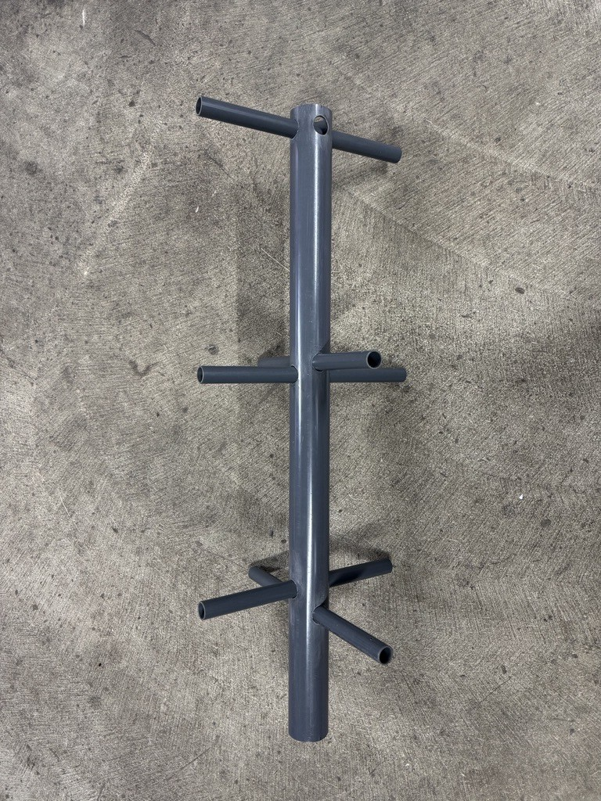

# QFH-Antenne – Vision-Ing 21
Ziel dieses Projektes ist es, eine funktionierende QFH (Quadrifilare Helixantenne) selbstständig zu bauen, um so Wetterdaten der Satelliten Meteor-M N2-3 und Meteor-M N2-4 automatisiert zu empfangen. 

Dieses Repository dient primär der Dokumentation des Fortschritts. Dieses Repository ist privat. 

## Ordnerstruktur
Übersicht der Ordner im Repository:
```
/
└───docs
    ├───cad
    │   ├───exports
    │   └───models
    └───images
        ├───cad
        ├───final
        └───progress
```

---

## Checkliste **Stand:** 02.01.2026

- [x] Gerüst der QFH-Antenne bauen
- [x] File Structure updaten
- [x] obere Querstreben fertigstellen
- [x] Drähte biegen und einsetzen
- [x] Verdrahtung
- [ ] Aufnahme von Satellitendaten

---

## Fortschritt/Status

### Fertigstellung der Antenne (02.01.2026)


---

### Gerüst der Antenne gebaut (23.12.2025)


---

## Projektplan
- [x] bis 06.01.2026: Fertigstellung der QFH-Antenne, erste analoge Tests
- [ ] bis 23.02.2026: Automatisierung der Aufzeichnung der Überflüge, der Dekodierung der Signale sowie Speicherung der Bilder
- [ ] bis 13.04.2026: Bau einer Nachführung, automatisierte Aktivierung und Steuerung der Nachführung bei Überflügen
- [ ] bis 10.05.2026: Automatisierung der Georeferenzierung, Abgleich der Daten mit Wetterbildern des Deutschen Wetterdienstes, Erzeugung eines eigenen Wetterberichts durch KI-Training mit den selbstgenerierten Wetterbildern
- [ ] bis 20.05.2026: Abgabe der Projektdokumentation
- [ ] Finale am 08.07.2026
